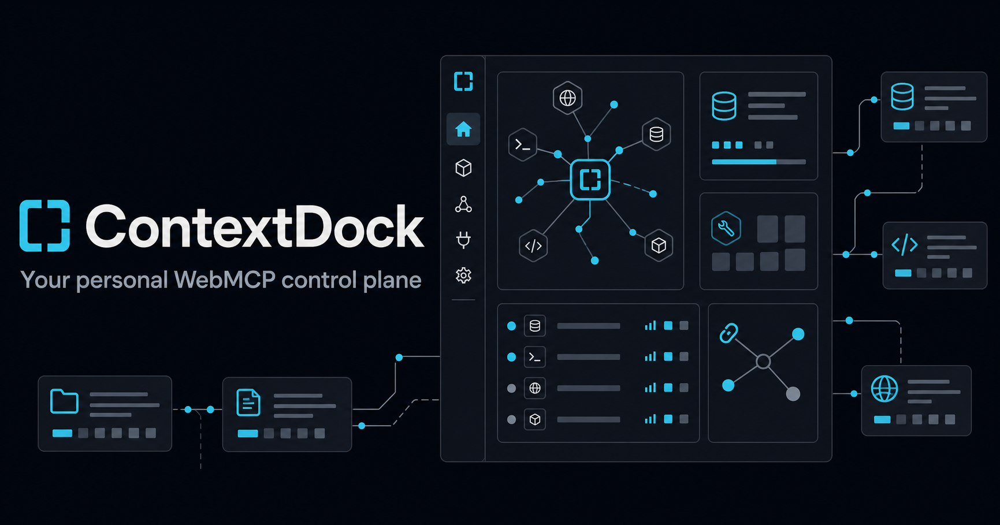

# ContextDock

> Your personal context. Your rules. Your agent.



ContextDock is a local-first personal knowledge workspace and WebMCP control plane. It stores notes, tasks, bookmarks, and snippets in the browser, lets the user assemble temporary Context Packs, and exposes only the tools and records allowed by the active pack and permission switches.

**Live demo:** https://contextdock-control-plane.alx21.chatgpt.site

The project is designed for the [WebMCP Challenge](https://openai.com/webmcp-challenge/). It demonstrates why structured page tools are more dependable and inspectable than simulating clicks: an agent can search real user-approved data, create or update an item through a typed interface, and immediately reflect the result in the same UI.

## Why ContextDock

Personal agents need useful context, but giving an agent an entire personal workspace is too broad. ContextDock makes the boundary explicit:

- **Spaces** organize durable information.
- **Context Packs** define the temporary subset an agent can access.
- **Permission switches** gate WebMCP, read operations, write operations, and item types.
- **Agent Activity** records successful and denied operations.
- **Undo** reverses recent agent writes.
- **IndexedDB** keeps the workspace browser-local; no account or API key is required.

## Judge quick start

1. Install and run the app:

   ```bash
   pnpm install
   pnpm dev
   ```

2. Open `http://localhost:3000` in a browser with WebMCP support, or use the live demo above.
3. Choose **Load Demo Workspace**.
4. Confirm **Atlas Launch** is active and WebMCP, Read, and Write are enabled.
5. Ask the agent:

   > Search my current context for unresolved launch blockers. Summarize them, then create one high-priority task for the most urgent blocker.

6. Watch the new task appear in ContextDock and in Agent Activity.
7. Turn **Allow write** off and ask:

   > Create a task called Publish final release.

   The write tools are unregistered immediately. Any in-flight or stale invocation is also rejected by the runtime permission checks and logged as denied.
8. Re-enable writes, create a task, and use **Undo** in Agent Activity.

The in-app **Try the WebMCP demo** dialog contains these prompts and a short accessibility follow-up.

## Product features

- Four item types: notes, tasks, bookmarks, and snippets
- Create and rename Spaces; create and activate Context Packs
- Pack scoping by whole Space or selected items, further restricted by item type
- Deterministic search ranking: exact title, tag, title token, then body/URL/Space matches
- Item create, edit, complete/reopen, and relation linking
- Human-readable agent audit trail with denial entries and reversible writes
- Versioned JSON export/import with strict validation and a 2 MB import limit
- First-run demo or empty workspace choices
- Responsive dashboard and permission panel
- Keyboard-visible focus, semantic labels, reduced-motion support, and readable empty/error states
- No authentication, cloud database, analytics, API key, or hidden remote dependency

## WebMCP tools

ContextDock registers tools with `document.modelContext.registerTool()` and an `AbortController`. Registration is rebuilt when permissions change, so disabled tools disappear immediately. Every handler independently repeats the permission and Context Pack checks.

| Tool | Mode | Purpose |
| --- | --- | --- |
| `get_active_context` | Read | Return the active Pack, permissions, and accessible count |
| `list_spaces` | Read | List accessible Spaces and item counts |
| `search_personal_context` | Read | Deterministically search scoped items |
| `get_personal_item` | Read | Retrieve one scoped item by ID |
| `list_recent_activity` | Read | Return recent readable audit entries |
| `create_personal_item` | Write | Create a validated item inside an allowed Space/type |
| `update_personal_item` | Write | Update a scoped item with field allowlisting |
| `complete_task` | Write | Complete or reopen a scoped task |
| `link_personal_items` | Write | Create a typed relation between two scoped items |
| `create_context_pack` | Write | Create, but never auto-activate, a new Pack |

Tool inputs use closed JSON Schemas (`additionalProperties: false`) and Zod runtime validation. Responses are concise structured objects with stable error codes. Read tools use `readOnlyHint`; content-bearing results use `untrustedContentHint`; write tools omit the read-only hint and describe their mutation explicitly.

Registration feature-detects `document.modelContext` and waits briefly for browsers that inject the Model Context API during page startup. Permission changes abort the prior registration lifecycle before registering the newly allowed tool set.

## Agent discovery

ContextDock remains a page-side WebMCP application rather than pretending to be a remote MCP or REST service. It also publishes crawlable product and trust information so agents can identify the site before JavaScript runs:

- `sitemap.xml` and an agent-welcoming `robots.txt`
- `llms.txt`, `index.md`, and `agents.md`
- `/.well-known/ard.json` with the legacy `ai-catalog.json` alias
- Canonical metadata, JSON-LD, and a markdown alternate link
- Crawlable `/about`, `/docs`, and `/privacy` pages

These resources document the existing application and its real tool surface; they do not introduce a remote API, account system, or payment flow.

## Architecture

```text
React UI
  ├─ live permission controls ──┐
  ├─ Spaces / Packs / Activity │
  └─ item workflows            │
                               ▼
WebMCP registry ── strict handler gates ── repository functions
                                                │
                                                ▼
                                  IndexedDB via Dexie
                                  items / spaces / packs
                                  settings / activity
                                  relations / undo
```

The UI and WebMCP tools call the same repository functions. That keeps validation, audit behavior, live refresh, and undo consistent regardless of whether a human or agent initiates an operation.

## Local development

Requirements: Node.js 22.13 or newer and pnpm.

```bash
pnpm install
pnpm dev
```

Quality checks:

```bash
pnpm typecheck
pnpm lint
pnpm test
pnpm build
```

`pnpm build` produces the deployable Vinext/Cloudflare output. See [DEPLOYMENT.md](DEPLOYMENT.md) for hosting and security-header notes.

## Data model and privacy

All workspace content is stored in IndexedDB under the current origin. Demo data is fictional and marked `Demo data` in the interface. Export produces a versioned JSON document; import validates the complete structure and rejects oversized, malformed, unsupported, or cross-reference-invalid data before replacing the workspace.

This is local-first, not encrypted-at-rest. Any script running on the same trusted origin can access the browser database. Review [SECURITY.md](SECURITY.md) before using real personal information.

## Repository guide

- `components/contextdock-app.tsx` — complete user experience and live workspace state
- `lib/repository.ts` — IndexedDB schema, validation, audit, undo, import/export
- `lib/webmcp.ts` — tool definitions, registration lifecycle, schemas, and handler gates
- `lib/permissions.ts` — Pack and permission enforcement
- `lib/search.ts` — deterministic ranking
- `lib/seed.ts` — fictional Project Atlas demo
- `tests/contextdock.test.ts` — permission, validation, undo, registration, and WebMCP integration tests
- `DEVPOST_SUBMISSION.md` — submission-ready copy
- `VIDEO_SCRIPT.md` — roughly 2 minute 20 second demo script

## Standards references

- [WebMCP specification](https://github.com/webmachinelearning/webmcp)
- [Chrome WebMCP overview](https://developer.chrome.com/docs/ai/webmcp)
- [Chrome guidance for secure WebMCP tools](https://developer.chrome.com/docs/ai/webmcp/secure-tools)

## License

MIT — see [LICENSE](LICENSE).
