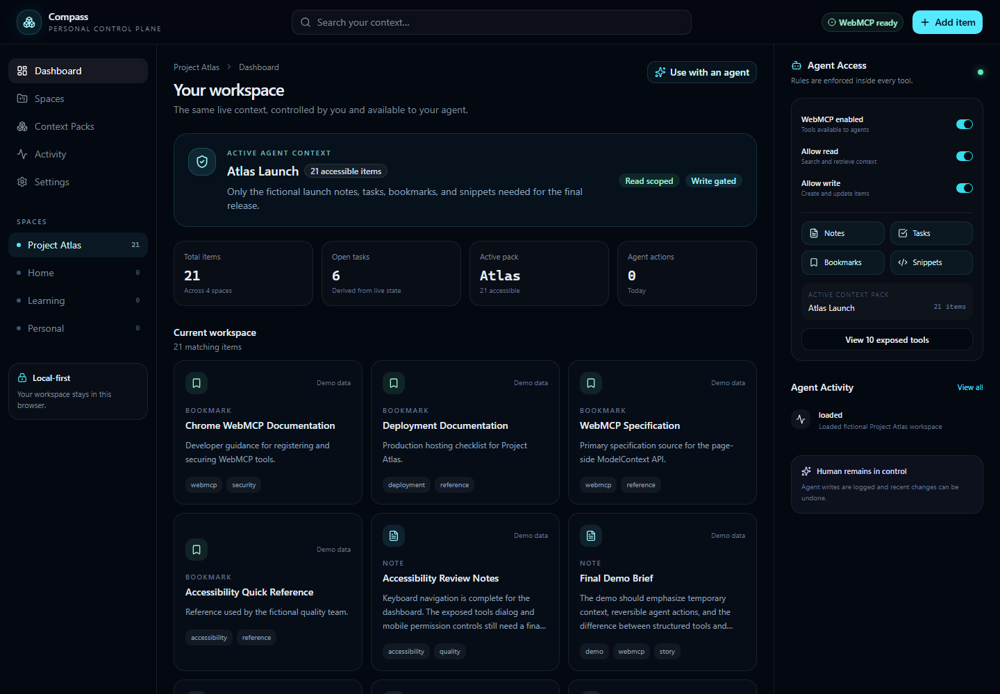

# Compass

[Open Compass](https://compass-control-plane.alx21.chatgpt.site/) · [User guide](https://compass-control-plane.alx21.chatgpt.site/docs) · [Agent guide](https://compass-control-plane.alx21.chatgpt.site/agents.md)

Keep notes, tasks, bookmarks and code snippets in your browser. Choose exactly which Spaces or individual items an agent can use through a Context Pack. Compass works manually in a normal browser; a browser with page-side WebMCP support can also search and change the same saved workspace through ten tools.



## Start using it

1. Open the site. A fresh browser starts with 21 clearly labeled fictional Project Atlas items so you can explore the workflow immediately.
2. To use your own content, open **Settings → Clear data** and confirm. This starts an empty workspace with WebMCP off. Existing users keep their saved data when the application updates.
3. Open **Spaces → Create Space**, then **Add item**. Choose note, task, bookmark or snippet. Items can be edited, linked by name, and tasks completed or reopened.
4. Open **Context Packs → Create Pack**. Select entire Spaces or individual items, choose allowed types, save, and explicitly **Activate** the Pack.
5. In **Agent Access**, enable WebMCP and choose read, write and type permissions. Ask your browser agent to work on the active Pack. Review the results and **Activity**.
6. Use **Settings → Export workspace** regularly. Data lives in this browser and site origin; clearing browser storage removes it. There is no account or cloud sync.

On phones, the navigation button opens Dashboard, Spaces, Context Packs, Activity and Settings. Agent Access appears below the workspace.

## A useful agent request

> Search my active Context Pack for unresolved launch blockers. Summarize the evidence, then create one high-priority task for the most important next step. Tell me exactly what you changed.

The fictional sample has relevant notes and tasks. For your own workspace, replace the subject with something in your content. Search uses deterministic text matching, not embeddings or an external model service. Compass itself does not run an assistant or require an API key; the browser agent supplies its own model and may send tool results to its provider.

## WebMCP tools

| Tool | Behavior |
| --- | --- |
| `get_active_context` | Report active Pack metadata, permitted types, counts and access settings. Available when WebMCP is enabled, even with read off. |
| `list_spaces` | List Spaces represented in the active scope, optionally with counts. |
| `search_personal_context` | Rank matching permitted items; optionally filter types, tags and Space. |
| `get_personal_item` | Retrieve one permitted item. |
| `list_recent_activity` | Return activity tied to items visible in the active scope. |
| `create_personal_item` | Create an allowed item in a Space wholly included in the Pack. |
| `update_personal_item` | Edit safe fields of an existing permitted item. |
| `complete_task` | Complete or reopen a permitted task. |
| `link_personal_items` | Relate two permitted items. |
| `create_context_pack` | Create an inactive Pack within the current scope; activation remains manual. |

Tools register through `document.modelContext`, with `navigator.modelContext` fallback. Compass briefly waits for browsers that inject the API after page load. The interface reports availability; ordinary browsers retain all manual features. This is a page-side integration, with no remote `/mcp` endpoint to add to a desktop MCP client.

Every call validates arguments and checks live settings inside the same IndexedDB transaction as its operation. Disabling write removes mutation tools and rejects retained calls. A Pack containing an individual item does not authorize its entire Space. Content is treated as data; snippets are never executed. Scope checks constrain Compass tools, not every action a browser agent could perform with separate browser permissions.

Pack and allowed-type changes use those live checks without rebuilding tool handles. Registration refreshes when WebMCP, read or write access changes, and tools clean up on page hide and register again when the page is restored from the back/forward cache.

## Undo, persistence and backups

- New agent item writes, links and Pack creation have a local activity entry and Undo action. Undo will refuse to overwrite later edits, remove referenced items, or remove an activated/changed Pack. Older actions without a safe snapshot must be edited manually.
- Same-origin tabs observe committed database changes. An editor opened before another change refuses a stale save; reopen the item to use current content.
- Export includes Spaces, items, Packs, relations and settings. Activity and undo history are local and are not included in backups.
- Import accepts version 1 Compass JSON up to 20 MB, validates IDs and cross-references before replacement, and requires confirmation. Invalid files leave the existing workspace intact. Imported WebMCP access stays off until you re-enable it.
- Resetting the sample and clearing data require confirmation. Export first. Local storage is not encrypted, and browser eviction or private-mode cleanup can remove it.

## Run locally

Use Node.js 24 and pnpm 11.19.0.

```sh
git clone https://github.com/agammann/compass-webmcp.git
cd compass-webmcp
pnpm install --frozen-lockfile
pnpm dev
```

Open the URL printed by the development server. Production preview:

```sh
pnpm build
pnpm start --port 3016
```

## Verify changes

```sh
pnpm test
pnpm lint
pnpm typecheck
pnpm security:audit
pnpm exec playwright install chromium
pnpm build
pnpm test:e2e
pnpm exec playwright install chrome
pnpm test:webmcp
```

Tests cover repository persistence, import integrity, permission changes, safe undo, manual browser workflows, mobile navigation and a simulated browser WebMCP adapter. The separate native suite uses real Chrome with WebMCP enabled; it fails if the native API is absent. GitHub Actions runs both suites and retains the native browser version and results.

The native suite discovers and calls all ten tools, verifies visible writes, reload persistence and human Undo, rejects invalid inputs, checks individual-item scope and permission revocation, and exercises registration cleanup and back navigation. Every test uses a fresh, isolated browser workspace with fictional data.

Verified on September 30, 2026:

| Environment | Result |
| --- | --- |
| Chrome 154.0.8037.93 with WebMCP enabled | All four native tests passed against the production Worker build, including actual back/forward cache restoration. |
| Edge 154.0.4258.48 with WebMCP enabled | The same four native tests passed against the production Worker build. |
| Codex in-app browser agent | Discovered and called all ten tools on the published app; writes and activity appeared in the interface. |
| Ordinary Chromium | Six browser tests passed using the production Worker, including manual use without native WebMCP. |

To try native WebMCP manually in Chrome, enable **WebMCP for testing** in `chrome://flags/#enable-webmcp-testing`, relaunch Chrome, and open Compass. See [Chrome's WebMCP setup](https://developer.chrome.com/docs/ai/webmcp) and [imperative API guide](https://developer.chrome.com/docs/ai/webmcp/imperative-api). WebMCP is experimental; browsers without it still support the manual workspace.

You can also run the native checks against a deployed copy or installed Edge:

```sh
COMPASS_WEBMCP_URL=https://compass-control-plane.alx21.chatgpt.site pnpm test:webmcp
COMPASS_WEBMCP_CHANNEL=msedge pnpm test:webmcp
```

In PowerShell, set `$env:COMPASS_WEBMCP_URL` or `$env:COMPASS_WEBMCP_CHANNEL` before running `pnpm test:webmcp`, then remove the variable when finished. The harness uses serialized tool arguments for Chrome/Edge 154 and object arguments for the API documented for Chrome 155; a passing run establishes compatibility with the browser version recorded in its results.

## Adapt the idea

Try the fictional workspace first, then create a small Pack containing one item and watch how it changes the agent's accessible context. For your own project, start with `lib/seed.ts` for sample content, `lib/webmcp.ts` for tool contracts, and `lib/repository.ts` for the operations shared by tools and the interface. Keep scope checks and Undo attached to the same operations as the app grows. Deployment to another origin creates a separate workspace; export and import content to move it.

## Project structure

- `components/compass-app.tsx`: workspace, editor, Packs, permissions, activity and backup controls.
- `lib/repository.ts`: Dexie persistence, validation, transactions, import/export and undo.
- `lib/webmcp.ts`: tool schemas, registration and permission checks.
- `lib/search.ts`: local text ranking.
- `tests/`, `e2e/`: unit and browser regression tests.

React, TypeScript, Vinext/Vite, Dexie and Tailwind. MIT licensed. See [deployment](DEPLOYMENT.md), [contributing](CONTRIBUTING.md) and [security](SECURITY.md).
